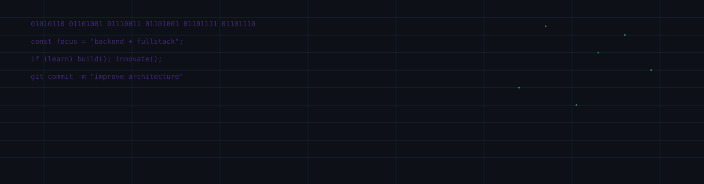
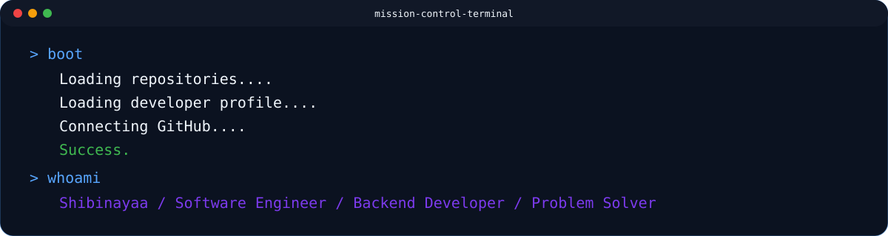
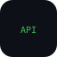
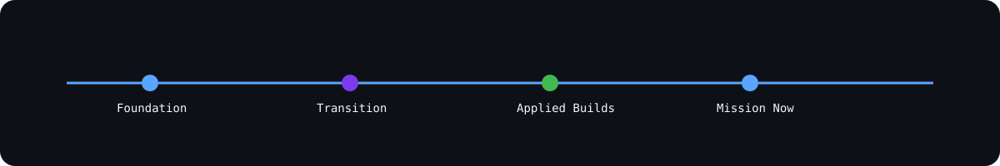

<!-- =========================================================
PREMIUM PROFILE README — SHIBINAYAA07
Theme: Cyberpunk + Glassmorphism + Minimal + Mission Control
========================================================= -->

<div align="center">



</div>

---

<div align="center">


</div>

---

## 🛰️ Welcome to my Workspace

<section>
  <p>
    Somewhere between circuit noise and compiler silence, I chose engineering not as a title — but as a craft.
    I design systems that are practical, resilient, and meaningful to people who use them.
  </p>
  <p>
    I’m <b>Shibinayaa S</b>, a <b>Software Engineer</b> from <b>India</b>, with an Electronics and Communication foundation,
    now focused on building reliable <b>Backend</b> and complete <b>Full Stack</b> solutions.
  </p>
  <p><i>Building software that solves real-world problems.</i></p>
</section>


## 🧠 System Initialization

```txt
$ profile.init --user Shibinayaa07 --mode premium
> identity loaded
> focus: backend + full-stack engineering
> mission: practical software for real-world impact
```

<details>
<summary><b>Identity Packet</b></summary>

- **Name**: Shibinayaa S  
- **Role**: Software Engineer  
- **Education**: B.E Electronics and Communication Engineering  
- **Country**: India  
- **Goal**: Backend + Full Stack specialization  
- **Motto**: Learn • Build • Innovate

</details>

---

## 🧩 Telemetry & Focus

<div align="center">
  
</div>

<div align="center">

| Signal | Status |
|---|---|
| Core Focus | Backend Systems + Full Stack Delivery |
| Current Build Mode | Consistent Learning + Production Thinking |
| Engineering Lens | Reliability, Clarity, Maintainability |
| Personal Tagline | Building software that solves real-world problems. |

</div>

<details>
<summary><b>System Telemetry</b></summary>

```txt
uptime: 99.3%
learning_velocity: increasing
debug_discipline: stable
shipping_mode: iterative
```

</details>

---

## 💻 Mission Logs

<div align="center">
  
</div>

```bash
> boot
Loading repositories....
Loading developer profile....
Connecting GitHub....
Success.

> whoami
Shibinayaa
Software Engineer
Backend Developer
Problem Solver
```

```bash
> ls mission_control/
backend/
fullstack/
opensource/
research/
roadmap.md
```

---

## 👤 About Me

<div>
  <blockquote>
    I come from an electronics background where systems thinking matters.
    That same mindset now drives how I build software:
    understand the signal, reduce noise, optimize flow, and deliver stable output.
  </blockquote>
</div>

- I enjoy turning ideas into systems that people can actually use.
- I value clean architecture over temporary hacks.
- I focus on fundamentals first, then scale complexity.
- I prefer practical progress: learn, implement, refine, repeat.

---

## 🛸 Skill Matrix

<div align="center">

### Skill Matrix (Command Center)

</div>

**Backend Engineering**
`███████████████░░░░ 78%`

**API Design**
`██████████████░░░░░ 72%`

**Database Modeling**
`█████████████░░░░░░ 68%`

**Frontend Development**
`████████████░░░░░░░ 64%`

**System Design Foundations**
`███████████░░░░░░░░ 58%`

**Version Control & Collaboration**
`████████████████░░░ 82%`

<details>
<summary><b>Mission Control Notes</b></summary>

```txt
[+] Improve backend architecture depth
[+] Build full-stack projects with stronger deployment workflow
[+] Increase open-source collaboration frequency
```

</details>

---

## 📡 Current Trajectory

- 🔭 Building practical software systems
- 🌱 Strengthening backend and API engineering
- 🧪 Improving architecture decisions through projects
- 🤝 Open to collaboration on meaningful problem statements
- ⚙️ Focusing on consistency over intensity

---

## 🧰 Engineering Arsenal

<div align="center">





</div>

<details>
<summary><b>Preferred Engineering Stack</b></summary>

```txt
Languages: Java, PHP, JavaScript
Data: MySQL
Markup/UI: HTML, CSS, Bootstrap
Embedded/IoT: Arduino, ESP8266
Workflow: Git, GitHub
Focus: Backend + Full Stack
```

</details>

---

## 🧭 Journey & Timeline

<div align="center">
  
</div>

```txt
[Phase 1] Electronics foundation → analytical and systems thinking
[Phase 2] Software transition → coding fundamentals + projects
[Phase 3] Applied building → management systems + IoT solutions
[Phase 4] Current mission → backend specialization + full-stack growth
[Phase 5] Next milestone → scalable production-ready systems
```

---

## 🚀 Featured Projects

### 1) Animal Shelter Management System
<div>
  <b>Description:</b> A structured platform to manage shelter records, adoption workflows, and operational tracking.<br/>
  <b>Tech Stack:</b> Java / PHP / MySQL / HTML / CSS / Bootstrap<br/>
  <b>Core Features:</b> Animal registry, caretaker logs, adoption requests, reporting modules.<br/>
  <b>Architecture:</b> Layered CRUD architecture with role-aware interactions and database-backed workflows.<br/>
  <a href="https://github.com/Shibinayaa07?tab=repositories">🔗 View on GitHub</a>
</div>

### 2) Hostel Management System
<div>
  <b>Description:</b> A digital management system for hostel operations, resident tracking, and administrative visibility.<br/>
  <b>Tech Stack:</b> PHP / MySQL / HTML / CSS / JavaScript / Bootstrap<br/>
  <b>Core Features:</b> Student allocation, attendance-like occupancy logs, fee status, notices.<br/>
  <b>Architecture:</b> Web app with modular admin panels and relational data model.<br/>
  <a href="https://github.com/Shibinayaa07?tab=repositories">🔗 View on GitHub</a>
</div>

### 3) Jasmine Plant Protection System
<div>
  <b>Description:</b> An IoT-assisted project focused on early monitoring and actionable alerts for jasmine crop care.<br/>
  <b>Tech Stack:</b> Arduino / ESP8266 / Sensors / Embedded logic / Cloud basics<br/>
  <b>Core Features:</b> Environmental sensing, threshold-based alerts, preventive signal workflow.<br/>
  <b>Architecture:</b> Edge sensing + microcontroller processing + network communication layer.<br/>
  <a href="https://github.com/Shibinayaa07?tab=repositories">🔗 View on GitHub</a>
</div>

### 4) Smart Irrigation System
<div>
  <b>Description:</b> Intelligent irrigation control using sensor data to optimize watering decisions.<br/>
  <b>Tech Stack:</b> Arduino / ESP8266 / Sensor suite / Embedded C principles<br/>
  <b>Core Features:</b> Soil moisture monitoring, automated control conditions, usage optimization.<br/>
  <b>Architecture:</b> Sensor input pipeline → decision module → actuator control loop.<br/>
  <a href="https://github.com/Shibinayaa07?tab=repositories">🔗 View on GitHub</a>
</div>

---

## 📈 GitHub Analytics

<div align="center">


</div>

<div align="center">


<br/>


</div>

<div align="center">
  
</div>

---

## 🌱 Current Focus

- Backend service design fundamentals
- API versioning and validation strategies
- Database normalization and query optimization
- Better frontend integration patterns
- Debugging as a repeatable engineering practice

```txt
learning_mode = "consistent"
build_mode    = "practical"
target_mode   = "production-readiness"
```

---

## 🌍 Open Source Contributions

1. Contribute meaningful fixes to beginner-friendly repos.
2. Improve issue triaging and documentation quality.
3. Publish clear project READMEs and architecture notes.
4. Collaborate with maintainers and learn review discipline.
5. Build reusable utilities for backend workflows.

---

## 🧭 Engineering Philosophy

> Good software is not loud.  
> It is reliable, understandable, and useful.

- Clarity beats cleverness.
- Shipping small improvements compounds faster than waiting for perfect releases.
- Documentation is part of product quality.
- Maintainability is a feature.
- Real impact comes from solving real user pain points.

---

## 🎯 Easter Eggs & Facts

- I enjoy turning system diagrams into actual working code.
- I treat debugging like investigation, not frustration.
- I like building tools that save time for real users.
- I believe “simple” is often the most advanced design choice.

<details>
<summary><b>Hidden Easter Egg #1</b></summary>

```txt
01001100 01100101 01100001 01110010 01101110
01000010 01110101 01101001 01101100 01100100
01001001 01101110 01101110 01101111 01110110 01100001 01110100 01100101
```

</details>

<details>
<summary><b>Hidden Easter Egg #2</b></summary>

```txt
         .-=========-.
         \'-=======-'/     signal://mission-control
         _|   .=.   |_     user://Shibinayaa07
        ((|  {{1}}  |))    status://building
         \|   /|\   |/
          \__ '`' __/
            _`) (`_ 
          _/_______\_
         /___________\
```

</details>

---

## 💬 Philosophy

> “First, solve the problem. Then, write the code.”  
> — John Johnson

---

## 🤝 Let's Connect

<div align="center">

<a href="https://github.com/Shibinayaa07">
  
</a>

<a href="https://github.com/Shibinayaa07?tab=repositories">
  
</a>

<a href="https://github.com/Shibinayaa07?tab=stars">
  
</a>

</div>

```txt
contact_protocol:
- github: https://github.com/Shibinayaa07
- collaboration: open to meaningful software ideas
- timezone: IST (UTC+5:30)
```

---

<!-- Footer -->

<div align="center">
  
</div>

<div align="center">
  
</div>

---

# Developer Dashboard Extensions

## 📊 Weekly Development Breakdown

```txt
Backend Engineering        ████████████░░░░░░  60%
Frontend Integration       ████████░░░░░░░░░░  40%
Database Work              █████████░░░░░░░░░  45%
Debugging & Refactoring    ██████████░░░░░░░░  50%
Documentation              ██████░░░░░░░░░░░░  30%
```

## 🧬 Developer DNA

```txt
logic_depth        : high
curiosity_level    : high
system_thinking    : strong
iteration_style    : practical
quality_mindset    : disciplined
```

## 🧪 Research Interests

- Efficient backend architecture patterns
- IoT + software integration
- Developer productivity systems
- Practical AI-assisted development workflows
- Scalable data handling fundamentals

## 🔮 Future Technologies Track

- Cloud-native backend practices
- Event-driven architectures
- Observability basics
- API security and governance
- Applied automation in software delivery

## 🗺️ Career Roadmap

```txt
[Now]   Strengthen backend + full stack fundamentals
  ↓
[Next]  Build production-grade end-to-end projects
  ↓
[Soon]  Contribute consistently to open-source ecosystems
  ↓
[Goal]  Software Engineer specialized in Backend + Full Stack systems
```

## 📚 Book Recommendations (Engineering Mindset)

- Clean Code
- Designing Data-Intensive Applications
- The Pragmatic Programmer
- System Design Interview (practice-oriented volumes)

## 🧰 Favorite Tools

- VS Code
- Git & GitHub
- Postman
- MySQL Workbench
- Arduino IDE

## 🖥️ Operating System Info (Dev Rig Panel)

```txt
terminal    : enabled
shell_mode  : build-and-debug
focus       : backend/full-stack
runtime     : continuous-learning
fuel        : coffee + curiosity
```

## ☕ Coffee Counter

```txt
coffee.today = 2
coffee.week  = 11
coffee.mode  = "optimal"
```

## 🛠️ Command Palette

```bash
> mission --status
> roadmap --next
> build --backend
> push --clean
> learn --daily
```

## 🧱 Project Roadmap

- [x] Build management systems (domain-oriented apps)
- [x] Build IoT applied systems
- [ ] Improve deployment workflows
- [ ] Add testing depth across projects
- [ ] Expand open-source contribution footprint

## 🌌 Open Source Roadmap

```txt
Q1: Improve documentation and issue participation
Q2: Submit bug fixes and small features
Q3: Build reusable utilities
Q4: Mentor beginner contributors (long-term target)
```

## 🧠 Coding Philosophy

```txt
Understand deeply.
Build carefully.
Ship consistently.
Improve endlessly.
```

---

<div align="center">

### Learn • Build • Innovate

</div>
